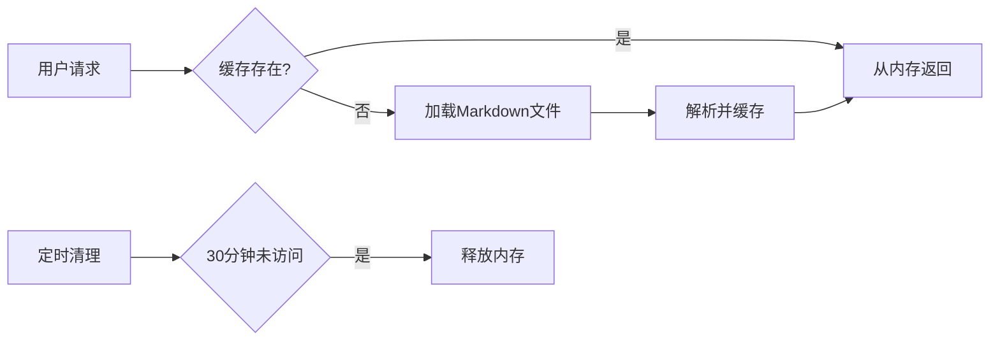

# MarkLume - 个人极简博客系统

  
*轻如羽毛，快如闪电的个人知识管理工具*

[](https://python.org)
[](https://opensource.org/licenses/MIT)
[](https://github.com/psf/black)

MarkLume 是一款为技术写作者、博主和知识工作者设计的极简博客系统，专注于提供无干扰的写作体验和高效的Markdown内容管理。

## ✨ 核心特性

- **纯文本优先** - 所有内容以Markdown格式存储，确保长期可访问性
- **零数据库依赖** - 文件系统即数据库，无需复杂配置
- **闪电般速度** - 内置智能缓存系统，毫秒级响应
- **优雅的渐进式UI** - 纯净的写作界面，无干扰阅读体验
- **完全隐私控制** - 所有数据存储在用户自己的设备/服务器上
- **轻量级架构** - 单个Python文件即可运行整个系统

## 🚀 快速开始

### 系统要求
- Python 3.13+

### 安装步骤

```bash
# 克隆仓库
git clone https://github.com/athenavi/marklume.git
cd marklume

# 安装依赖 (推荐使用虚拟环境)
python -m venv .venv
source .venv/bin/activate

pip install -r requirements.txt

# 初始化存档目录
mkdir -p archive

# 启动服务
uvicorn main:app --reload
```

### Docker运行

```bash
docker build -t marklume .
docker run -d -p 8000:8000 -v ./archive:/app/archive marklume
```

访问 [http://localhost:8000](http://localhost:8000) 开始使用

## 📚 使用指南

### 基本操作
1. 创建文章：点击"新建文章"按钮
2. 编辑文章：点击文章标题旁边的编辑图标
3. 删除文章：在编辑模式下点击删除按钮

### 键盘快捷键（开发中）
- `Ctrl+S`：保存当前文章
- `Ctrl+E`：切换编辑模式
- `Ctrl+/`：显示帮助

### 文件管理
所有文章存储在`/archive`目录中，以Markdown格式保存：
```
archive/
  ├── getting-started.md
  ├── advanced-features.md
  └── migration-guide.md
```

## 🌟 功能亮点

### 智能缓存系统


## 🤝 贡献指南

我们欢迎各种形式的贡献！请遵循以下步骤：

1. Fork项目仓库
2. 创建特性分支 (`git checkout -b feature/amazing-feature`)
3. 提交更改 (`git commit -m 'Add some amazing feature'`)
4. 推送到分支 (`git push origin feature/amazing-feature`)
5. 提交Pull Request

## 📜 许可证

MarkLume采用[MIT许可证](LICENSE)发布，您可以自由地：

- 在任何项目中免费使用
- 修改源代码以满足需求
- 分发软件的副本
- 用于商业目的

## 🌍 社区支持

- [问题追踪](https://github.com/athenavi/marklume/issues)

## 致谢

MarkLume的诞生受到以下项目的启发：

- [Docsify](https://docsify.js.org/) - 文档网站生成器
- [htmx](https://htmx.org/) - high power tools for HTML
- [Jekyll](https://jekyllrb.com/) - 静态网站生成器先驱

---

**MarkLume** © 2025 Athenavi. Released under the [MIT License](https://github.com/athenavi/marklume/blob/main/LICENSE).